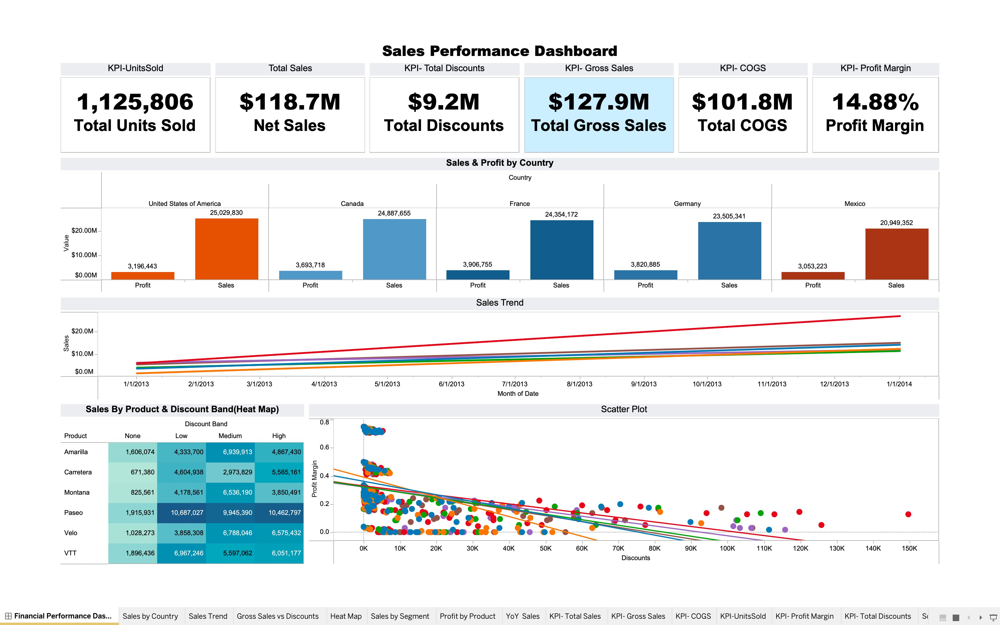
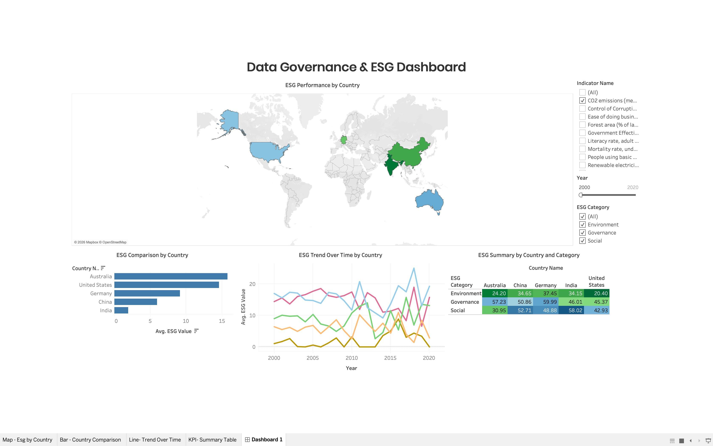

# 📊 Tableau Dashboards — Prerna Rai

A collection of interactive Tableau dashboards covering financial performance, HR analytics, and ESG/data governance. Each project demonstrates end-to-end dashboard development — from raw CSV data to business-ready visuals with KPIs, trend analysis, and interactive filters.

---

## Projects

### 💰 [Financial Performance Dashboard](./financial-performance-dashboard/)

> Sales KPIs, country-level profit analysis, discount impact heat map, and trend lines across 5 countries and 6 product lines.

---

### 👥 [HR Analytics Dashboard](./hr-analytics-dashboard/)

> Workforce headcount, turnover by department, gender & diversity breakdown, salary equity, engagement vs performance, and recruitment source analysis.

---

### 🌍 [Data Governance & ESG Dashboard](./data-governance-esg-dashboard/)

> ESG scores by country mapped geographically, trend analysis from 2000–2020, country benchmarking across Environment, Governance, and Social pillars.

---

## Tools & Skills Demonstrated

- **Tableau Desktop** — worksheets, dashboards, calculated fields, interactive filters
- **Chart Types** — KPI cards, heat maps, line charts, bar charts, scatter plots, maps
- **Techniques** — segmentation, trend analysis, turnover metrics, ESG scoring, blended data sources

---

## Author

**Prerna Rai** — Data Analyst | SQL · Power BI · Tableau · Excel · Python  
📧 prernarai200q@gmail.com  
🔗 [LinkedIn](https://linkedin.com/in/prerna-rai-b3a6a828a) · [GitHub](https://github.com/prernarai07)
