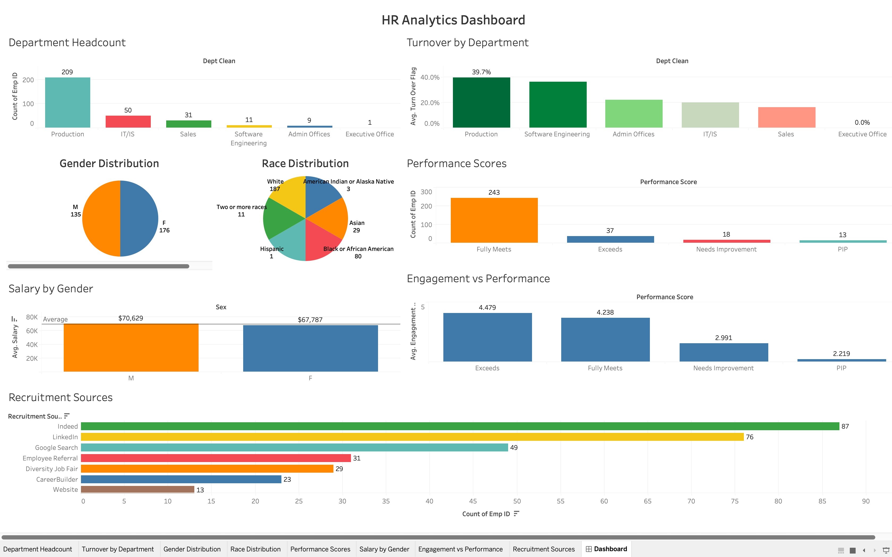

# 👥 HR Analytics Dashboard — Tableau

An interactive Tableau dashboard exploring workforce metrics including headcount, turnover, engagement, performance, and diversity using a real HR dataset.

---

## Dashboard Overview

**File:** `HR_Analytics_Dashboard_Prerna_Rai.twb`  
**Data Source:** `HRDataset_v14.csv`  
**Tool:** Tableau Desktop 2026.1

---

## Sheets & Visualisations

| Sheet | Type | Purpose |
|---|---|---|
| Department Headcount | Bar Chart | Employee count by department |
| Gender Distribution | Pie / Bar | Workforce gender breakdown |
| Race Distribution | Bar Chart | Diversity by racial group |
| Salary by Gender | Box / Bar | Pay comparison across genders |
| Performance Scores | Bar / KPI | Distribution of performance ratings |
| Engagement vs Performance | Scatter Plot | Correlation between engagement and output |
| Recruitment Sources | Bar Chart | Which channels bring the most hires |
| Turnover by Department | Bar Chart | Attrition rates across departments |
| **Dashboard 1** | **Dashboard** | **Combined interactive HR overview** |

---

## Key Metrics Tracked

- Department-level headcount and attrition
- Gender and racial diversity ratios
- Salary equity analysis by gender
- Employee engagement vs performance correlation
- Recruitment source effectiveness
- Turnover flag analysis

---

## Calculated Fields Used

| Calculated Field | Description |
|---|---|
| Turn Over Flag | Binary flag identifying terminated employees |
| Is Minority | Flag for minority classification |
| Dept Clean | Cleaned/standardised department names |
| Age | Derived age from hire date |

---

## Dataset

**Source:** `HRDataset_v14.csv` — a widely used public HR dataset for analytics practice.

Key fields include: Employee ID, Department, Position, Salary, Gender, Race/Ethnicity, Performance Score, Engagement Survey, Date of Hire, Date of Termination, Recruitment Source, Termination Reason.

---

## How to Open

1. Download `HR_Analytics_Dashboard_Prerna_Rai.twb`
2. Open in Tableau Desktop
3. Reconnect the data source to your local copy of `HRDataset_v14.csv`

---

## Skills Demonstrated

- Workforce diversity and equity analysis
- Calculated fields for derived HR metrics
- Scatter plot for engagement vs performance correlation
- Turnover and attrition analysis
- Multi-sheet dashboard with interactive filters
